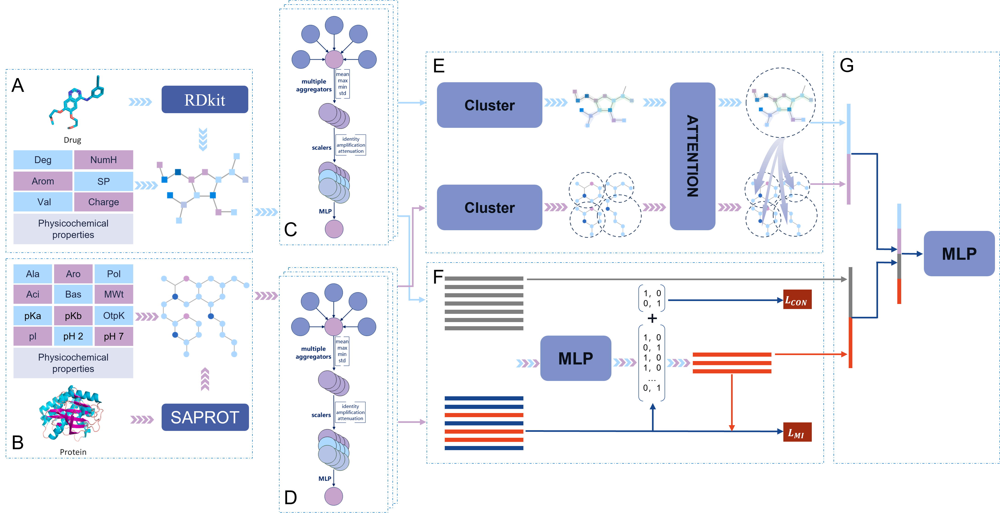

# PSDTA: An approach to drug-target binding affinity prediction by integrating physicochemical and structural information to reduce feature redundancy



## PSDTA Environment Setup for Local Deployment

Currently, PSDTA is validated for use on  Linux. We recommend installation via conda.

```
conda env create -f environment.yml
conda activate PSDTA
pip install torch_scatter torch_sparse torch_cluster torch_spline_conv -f https://data.pyg.org/whl/torch-2.1.0+cu118.html
```

## Prepare dataset

Create a train, valid and test csv file in a datafolder (for examples, see the dataset folder). 

```
python main.py --datafolder dataset/pdb2016 --result_path result/PDB2016_BENCHMARK
```

## Dataset Structure

| ID   | Ligand                                                       | Protein  | Target_Chain | regression_label |
| ---- | ------------------------------------------------------------ | -------- | ------------ | ---------------- |
| 1a30 | CC(C)C[C@H](NC(=O)[C@H](CC(=O)[O-])NC(=O)[C@@H]([NH3+])CCC(=O)[O-])C(=O)[O-] | PQITL... | A            | 4.3              |
| 1bcu | Nc1ccc2cc3ccc(N)cc3nc2c1                                     | ADCG...  | L            | 3.28             |

## Start training

1、Create the virtual environment

2、Prepare the CSV dataset and the corresponding protein PDB files, and place them in the designated locations(The data files required for training have been uploaded to Google Drive and can be downloaded for training. The link is: https://drive.google.com/drive/folders/11R0lLxFyWMlpQtQhCqC3d529le3oZS3n?usp=drive_link)

3、Start training

For example, training with the PDBBind2016 dataset

python main.py --dataf

```
python main.py --datafolder dataset/pdb2016 --result_path result/PDB2016_BENCHMARK
```


